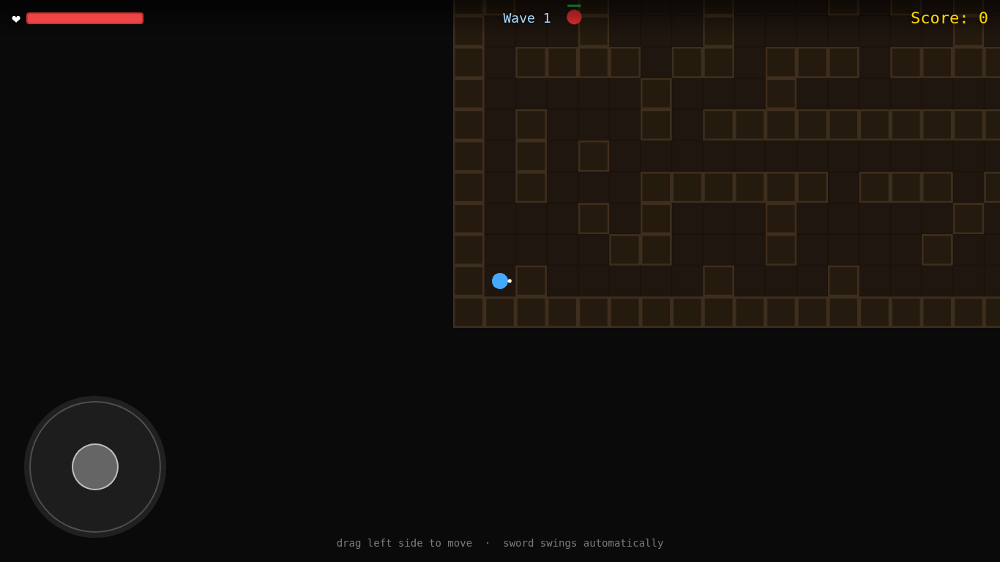

# Dungeon Crawler 3JS

A simple real-time 2D dungeon crawler with a top-down view, built with Three.js. Mobile-first with touch and drag movement controls.

## Play Live

**[Play in browser](https://sandbox-vm-kenyon.github.io/dungeon-crawler-3js-game/)** — hosted on GitHub Pages, no install required.

## Screenshot

## Features

- **Top-down 2D view** rendered with Three.js
- **Auto sword attack** with a 120-degree sweep arc
- **Mobile-first controls** — touch and drag to move
- **Procedural dungeon** — rooms and corridors generated each run
- **Enemy waves** — enemies spawn in waves and hunt the player
- **BFS flow-field pathfinding** — enemies navigate corridors correctly
- **Facing override** — player auto-faces the nearest enemy when in range

## How to Play

1. Open `index.html` in a browser (no build step required — uses CDN Three.js)
2. **Move**: drag the joystick (bottom-left) or use WASD / arrow keys on desktop
3. **Sword**: auto-fires a 120° sweep when an enemy is within range
4. **Goal**: survive as many waves as possible

## Controls

| Input | Action |
|---|---|
| Touch drag (joystick zone) | Move player |
| WASD / Arrow keys | Move player (desktop) |
| Automatic | Sword sweep toward facing / nearest enemy |

## Technical Notes

- Single-file HTML with CDN Three.js — no build step
- Instanced meshes for dungeon walls for performance
- Slide-axis collision (try X then Y independently) to prevent wall-sticking
- BFS flow-field pathfinding rebuilt on each tile-boundary crossing
- `dt` clamped to 0.1s to prevent physics spiral-of-death on tab restore
- Per-swing hit tracking via a `Set` prevents multi-hit within a single sweep
- Safe-area insets (`env(safe-area-inset-*)`) with `viewport-fit=cover` for notched phones

## Known Limitations

- No persistent score — resets on page reload
- Enemy pathfinding is 4-directional (cardinal only); enemies may appear to move in stepped paths in open spaces
- No separation force between enemies — they can bunch on the same tile
- Sword auto-fires toward current facing rather than free-aim

## License

MIT
